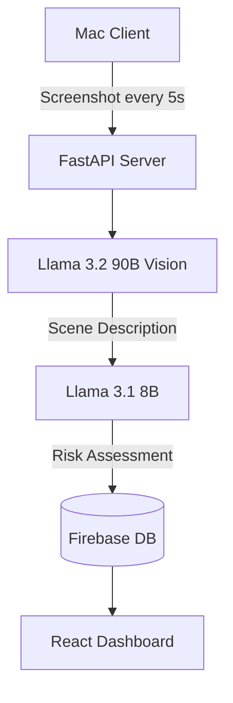
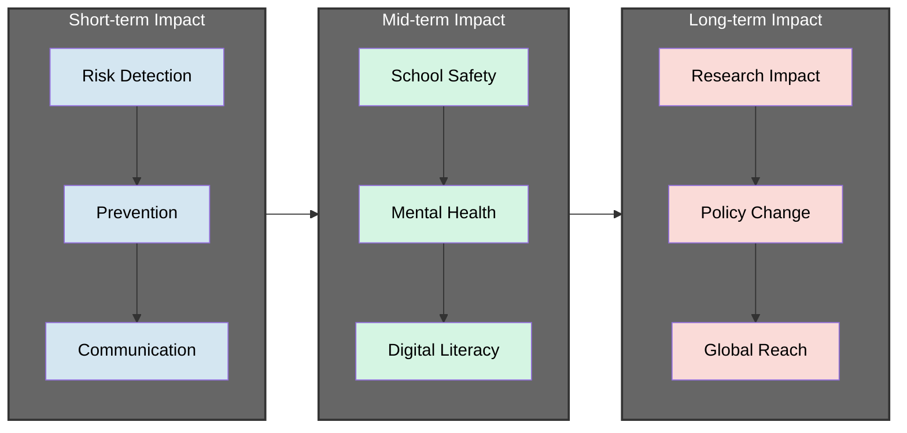
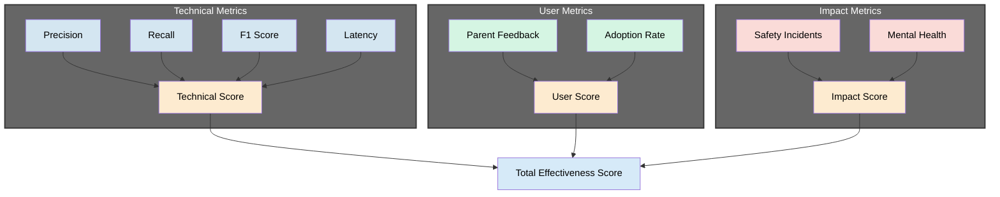
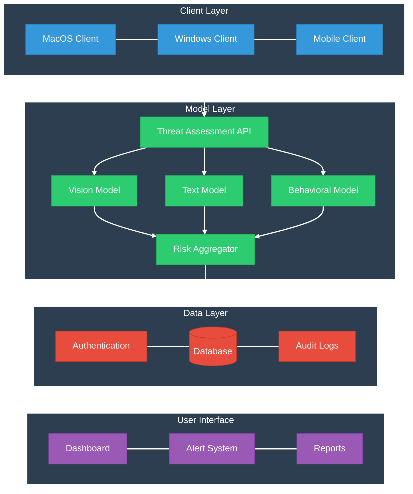

# GuardianAI 
Protecting Young Minds Through Intelligent Content Analysis

Hackathon Demo Video: [link](https://www.youtube.com/shorts/b1N_IlpLjUU)

## Hackathon POC

## Project Impact

## Performance Metrics

## Expanded System Architecture

