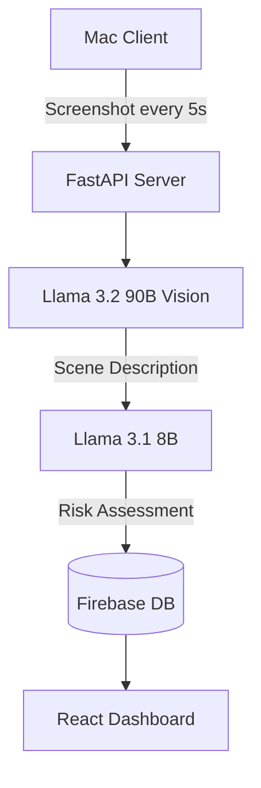

```
npm install
npm run dev
```


```mermaid
graph TD
    A[Mac Client] -->|Screenshot every 5s| B[FastAPI Server]
    
    B --> C[Llama 3.2 90B Vision]
    C -->|Scene Description| D[Llama 3.1 8B]
    D -->|Risk Assessment| E[(Firebase DB)]
    E --> F[React Dashboard]
    
    style A fill:#d4e6f1 color:#000000
    style B fill:#d5f5e3 color:#000000
    style C fill:#fadbd8 color:#000000
    style D fill:#fadbd8 color:#000000
    style E fill:#fdebd0 color:#000000
    style F fill:#d6eaf8 color:#000000

```